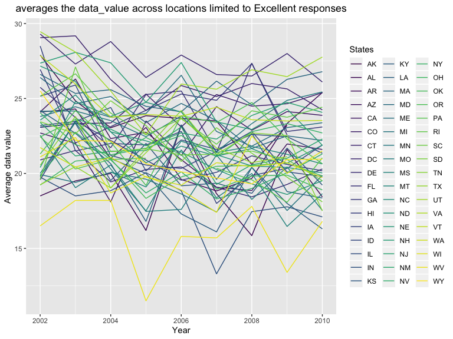
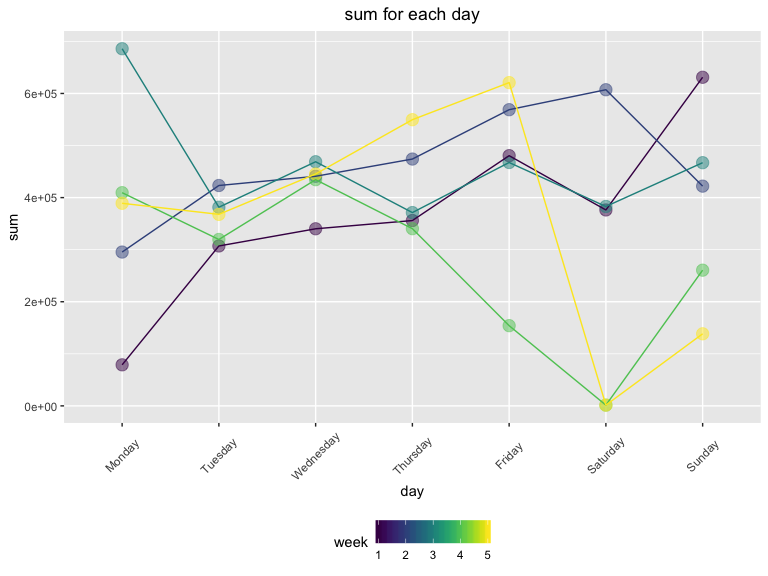

p8105\_hw3\_ys3298
================
Yimeng SHANG
10/3/2019

``` r
library(p8105.datasets)
library(tidyverse)
```

    ## ── Attaching packages ────────────────────────────────────────────────────────────────────── tidyverse 1.2.1 ──

    ## ✔ ggplot2 3.2.1     ✔ purrr   0.3.2
    ## ✔ tibble  2.1.3     ✔ dplyr   0.8.3
    ## ✔ tidyr   1.0.0     ✔ stringr 1.4.0
    ## ✔ readr   1.3.1     ✔ forcats 0.4.0

    ## ── Conflicts ───────────────────────────────────────────────────────────────────────── tidyverse_conflicts() ──
    ## ✖ dplyr::filter() masks stats::filter()
    ## ✖ dplyr::lag()    masks stats::lag()

``` r
library(patchwork)
data("instacart")
data("brfss_smart2010")
accel = read_csv("./data/accel_data.csv") 
```

    ## Parsed with column specification:
    ## cols(
    ##   .default = col_double(),
    ##   day = col_character()
    ## )

    ## See spec(...) for full column specifications.

``` r
aisle_num =
  instacart %>%
  group_by(aisle) %>%
  summarise(number = n()) %>%
  count() %>%
  as.integer()
aisle_num 
```

    ## [1] 134

``` r
aisle_max = 
  instacart %>%
  group_by(aisle) %>%
  summarise(number = n()) %>%
  filter(number == max(number)) %>%
  select(-number) %>%
  as.character()
aisle_max
```

    ## [1] "fresh vegetables"

# Problem1

## Short description

**The size and structure of the data:** There are 1384617 observations
and 15 variables in the data. It’s a (1384617, 15) dataframe. Most of
the variable types are integers and some are characters.

**Some key variables:** Product name; aisle; department; order number
and so on.

**illstrative examples of observations:** For the 1st order, there’re 8
different kind of products. Eval set is train. In details, the first
product is Bulgarian Yogurt, aisle id is 120, department id is 16, aisle
is yogurt, department is dairy eggs. For the second observations, aisle
id is 108, department id is 16, aisle is other creams cheeses,
department is dairy eggs .

**How many aisles are there, and which aisles are the most items ordered
from?** There are 134 aisles. The most items ordered from fresh
vegetables. comment: the order from different aisles are very different,
vegetable is the most and then fresh fruit.

## Make a plot

``` r
  instacart %>%
  group_by(aisle) %>%
  summarise(number = n()) %>%
  filter(number > 10000) %>%
  ggplot(aes(x = reorder(aisle, number), y = number, fill = aisle)) +
  geom_col() + coord_flip() +
  viridis::scale_fill_viridis(option = "viridis" , discrete = TRUE) +
  labs(
    title = "The number of items ordered in each Aisle",
    x = "aisles",
    y = "number"
  ) +
  theme(plot.title = element_text(hjust = 0.5))
```


Comment: From the plot, we can clearly see the rank of number of items
ordered in each aisle. The orders from fresh vegetables are the most and
butter is the least within those whose order is more than 10000.

## Table1: most popular items in each aisles

``` r
baking = 
  instacart %>%
  group_by(product_name) %>%
  filter(aisle == "baking ingredients") %>%
  summarise(order_times = n()) %>%
  arrange(desc(order_times)) %>%
  head(n = 3) %>%
  mutate(group = "baking ingredients") %>%
  select(group, everything())

dog = 
  instacart %>%
  group_by(product_name) %>%
  filter(aisle == "dog food care") %>%
  summarise(order_times = n()) %>%
  arrange(desc(order_times)) %>%
  head(n = 3) %>%
  mutate(group = "dog food care") %>%
  select(group, everything())

vege =
  instacart %>%
  group_by(product_name) %>%
  filter(aisle == "packaged vegetables fruits") %>%
  summarise(order_times = n()) %>%
  arrange(desc(order_times)) %>%
  head(n = 3) %>%
  mutate(group = "packaged vegetables fruits") %>%
  select(group, everything())

bind_rows(baking, dog, vege) %>%
  knitr::kable(caption="top3 popular items in specific aisles")
```

| group                      | product\_name                                 | order\_times |
| :------------------------- | :-------------------------------------------- | -----------: |
| baking ingredients         | Light Brown Sugar                             |          499 |
| baking ingredients         | Pure Baking Soda                              |          387 |
| baking ingredients         | Cane Sugar                                    |          336 |
| dog food care              | Snack Sticks Chicken & Rice Recipe Dog Treats |           30 |
| dog food care              | Organix Chicken & Brown Rice Recipe           |           28 |
| dog food care              | Small Dog Biscuits                            |           26 |
| packaged vegetables fruits | Organic Baby Spinach                          |         9784 |
| packaged vegetables fruits | Organic Raspberries                           |         5546 |
| packaged vegetables fruits | Organic Blueberries                           |         4966 |

top3 popular items in specific aisles

Comment: From the table, the most popular items from baking ingredients
are cane sugar, light brown sugar and pure baking soda. In the group of
dog food care, organix chicken\&brown rice recipe, small dog biscuits,
snack sticks chicken & rice recipe dog treats are the top3 popular
items. And in the group of packaged vegetables fruits, organic baby
spinach, organic blueberries, organic raspverries sells best.

## Table2: mean hour of a day ordered on each day

``` r
instacart %>%
  select(product_name, order_hour_of_day, order_dow) %>%
  filter(product_name == "Pink Lady Apples" | product_name == "Coffee Ice Cream") %>%
  group_by(product_name, order_dow) %>%
  summarise(
    mean_hour = mean(order_hour_of_day)
  ) %>%
  mutate(
    mean_hour = round(mean_hour,1),
    order_dow = recode(order_dow, "0" = "Sun", "1" = "Mon", "2" = "Tue", "3" = "Wed", "4" = "Thur", "5" = "Fri", "6" = "Sat")
  ) %>%
  pivot_wider(
    names_from = "order_dow",
    values_from = "mean_hour"
  ) %>%  
  knitr::kable(caption="Mean hour of a day ordered on each day")
```

| product\_name    |  Sun |  Mon |  Tue |  Wed | Thur |  Fri |  Sat |
| :--------------- | ---: | ---: | ---: | ---: | ---: | ---: | ---: |
| Coffee Ice Cream | 13.8 | 14.3 | 15.4 | 15.3 | 15.2 | 12.3 | 13.8 |
| Pink Lady Apples | 13.4 | 11.4 | 11.7 | 14.2 | 11.6 | 12.8 | 11.9 |

Mean hour of a day ordered on each day

Comment: From this table, we can clearly see the mean hour of the day at
which pink lady apples and coffee ice cream are ordered on each day of
the week. Coffee ice cream is ordered most on Tuesday and least on
Friday.

# Problem2

``` r
##cleaning
  brfss_OH =
  brfss_smart2010 %>%
  janitor::clean_names() %>%
  filter(topic == "Overall Health") %>%
  mutate(
    response = factor(response, levels = c("Poor", "Fair", "Good", "Very good", "Excellent"), ordered = TRUE )
  )
brfss_OH
```

    ## # A tibble: 10,625 x 23
    ##     year locationabbr locationdesc class topic question response
    ##    <int> <chr>        <chr>        <chr> <chr> <chr>    <ord>   
    ##  1  2010 AL           AL - Jeffer… Heal… Over… How is … Excelle…
    ##  2  2010 AL           AL - Jeffer… Heal… Over… How is … Very go…
    ##  3  2010 AL           AL - Jeffer… Heal… Over… How is … Good    
    ##  4  2010 AL           AL - Jeffer… Heal… Over… How is … Fair    
    ##  5  2010 AL           AL - Jeffer… Heal… Over… How is … Poor    
    ##  6  2010 AL           AL - Mobile… Heal… Over… How is … Excelle…
    ##  7  2010 AL           AL - Mobile… Heal… Over… How is … Very go…
    ##  8  2010 AL           AL - Mobile… Heal… Over… How is … Good    
    ##  9  2010 AL           AL - Mobile… Heal… Over… How is … Fair    
    ## 10  2010 AL           AL - Mobile… Heal… Over… How is … Poor    
    ## # … with 10,615 more rows, and 16 more variables: sample_size <int>,
    ## #   data_value <dbl>, confidence_limit_low <dbl>,
    ## #   confidence_limit_high <dbl>, display_order <int>,
    ## #   data_value_unit <chr>, data_value_type <chr>,
    ## #   data_value_footnote_symbol <chr>, data_value_footnote <chr>,
    ## #   data_source <chr>, class_id <chr>, topic_id <chr>, location_id <chr>,
    ## #   question_id <chr>, respid <chr>, geo_location <chr>

``` r
location2002 =
  brfss_OH %>%
  filter(year ==  "2002") %>%
  group_by(locationabbr) %>%
  distinct(locationdesc) %>%
  summarise(total_location = n()) %>%
  filter(total_location >= 7) %>%
  arrange(total_location)
location2002
```

    ## # A tibble: 6 x 2
    ##   locationabbr total_location
    ##   <chr>                 <int>
    ## 1 CT                        7
    ## 2 FL                        7
    ## 3 NC                        7
    ## 4 MA                        8
    ## 5 NJ                        8
    ## 6 PA                       10

``` r
location2010 =
  brfss_OH %>%
  filter(year ==  "2010") %>%
  group_by(locationabbr) %>%
  distinct(locationdesc) %>%
  summarise(total_location = n()) %>%
  filter(total_location >= 7) %>%
  arrange(total_location)
location2010 
```

    ## # A tibble: 14 x 2
    ##    locationabbr total_location
    ##    <chr>                 <int>
    ##  1 CO                        7
    ##  2 PA                        7
    ##  3 SC                        7
    ##  4 OH                        8
    ##  5 MA                        9
    ##  6 NY                        9
    ##  7 NE                       10
    ##  8 WA                       10
    ##  9 CA                       12
    ## 10 MD                       12
    ## 11 NC                       12
    ## 12 TX                       16
    ## 13 NJ                       19
    ## 14 FL                       41

Comment: In 2002, CT, FL, NC, MA, NJ, PA were observed at 7 or more
locations. Total: 6

In 2010, CO, PA, SC, OH, MA, NY, NE, WA, CA, MD, NC, TX, NJ, FL were
observed at 7 or more locations. Total: 14

It’s more in 2010 than 2002.

``` r
Averagedf =
  brfss_OH %>%
  filter(response == "Excellent") %>%
  group_by(locationabbr, year) %>%
  summarise(average = mean(data_value)) %>%
  select(year, locationabbr, average)


  brfss_OH %>%
  filter(response == "Excellent") %>%
  group_by(locationabbr, year) %>%
  summarise(average = mean(data_value)) %>%
  select(year, locationabbr, average) %>%
  ggplot(aes(x = year, y = average, color = locationabbr, group = locationabbr)) +
  geom_line() + 
    labs(
      title = "averages the data_value across locations limited to Excellent responses",
      x = "Year",
      y = "Average data value"
    ) +
  viridis::scale_color_viridis(
    name = "States",
    discrete = TRUE) +
    theme(plot.title = element_text(hjust = 0.5))
```



Comment: This figure has so many states information, so it’s not so
clearly to see. We notice that most of the states fluctuate from 2002 to
2010. Also, I do notice that there’re a few NAs after take the average(I
don’t think it’s necessary to drop them).

``` r
brfss_OH  %>% 
  filter(year == "2006" | year == "2010" ) %>% 
  filter(locationabbr == "NY") %>% 
  ggplot(aes(x = response, y = data_value,fill = locationdesc)) +
  geom_line(aes(group = locationdesc, color = locationdesc)) +
  geom_bar(stat = "identity", position = "dodge") +
  geom_point(size = 2, alpha = 0.5) +
  labs(
    title = " Data value of NY"
  ) +
  facet_grid(~year)
```


Comment: From the Plot, we can see the distribution of data value for
reponses among locations. “Poor” was the lowest and “Very good” and
“Excellent” and relatively high. There is difference in different
locations. Form 2006 to 2010, the distribution changed a little bit, but
the whole distribution is similar. Or we can also use boxplot as
following:

``` r
brfss_OH  %>% 
  filter(year == "2006" | year == "2010" ) %>% 
  filter(locationabbr == "NY") %>% 
  ggplot(aes(x = response, y = data_value)) +
  geom_boxplot() +
    labs(
    title = " Data value distribution of NY"
  ) +
  facet_grid(~year)
```


# Problem3

``` r
accel = 
  accel %>%
  janitor::clean_names() %>% 
  mutate(day = ordered(day, levels=c("Monday", "Tuesday",
                      "Wednesday","Thursday","Friday","Saturday","Sunday"))) %>%
  arrange(week, day) %>%
  mutate(sorted_DayId=1:n()) %>%
  select(-day_id) %>%
  pivot_longer(cols=starts_with("activity_"), 
               names_prefix = "activity_",
               names_to="activity") %>%
  mutate(activity=as.integer(activity)) %>%
  arrange(week, day, activity) %>% 
  mutate(time=1:n()) %>%
  mutate(day_type = if_else(day<="Friday","WeekDay","WeekEnd")) %>% 
  mutate(value = round(value, 0)) %>% 
    mutate_if(is.double, as.integer)

accel
```

    ## # A tibble: 50,400 x 7
    ##     week day    sorted_DayId activity value  time day_type
    ##    <int> <ord>         <int>    <int> <int> <int> <chr>   
    ##  1     1 Monday            1        1     1     1 WeekDay 
    ##  2     1 Monday            1        2     1     2 WeekDay 
    ##  3     1 Monday            1        3     1     3 WeekDay 
    ##  4     1 Monday            1        4     1     4 WeekDay 
    ##  5     1 Monday            1        5     1     5 WeekDay 
    ##  6     1 Monday            1        6     1     6 WeekDay 
    ##  7     1 Monday            1        7     1     7 WeekDay 
    ##  8     1 Monday            1        8     1     8 WeekDay 
    ##  9     1 Monday            1        9     1     9 WeekDay 
    ## 10     1 Monday            1       10     1    10 WeekDay 
    ## # … with 50,390 more rows

Comment: I rearrange the day\_id in oreder to put it into right order.
For this resulting dataset, there are 50400 observations and 7
variables. It also includes the week, day ID, weekend or weekday
information. I round all activity value data into integer in order to
see clearly.

## Total activity variable for each day

``` r
accel_sum = accel %>% 
  group_by(week,day,sorted_DayId,day_type) %>% 
  summarise(value=sum(value)) 
knitr::kable(accel_sum)
```

| week | day       | sorted\_DayId | day\_type |  value |
| ---: | :-------- | ------------: | :-------- | -----: |
|    1 | Monday    |             1 | WeekDay   |  78830 |
|    1 | Tuesday   |             2 | WeekDay   | 307103 |
|    1 | Wednesday |             3 | WeekDay   | 340113 |
|    1 | Thursday  |             4 | WeekDay   | 355948 |
|    1 | Friday    |             5 | WeekDay   | 480534 |
|    1 | Saturday  |             6 | WeekEnd   | 376254 |
|    1 | Sunday    |             7 | WeekEnd   | 631105 |
|    2 | Monday    |             8 | WeekDay   | 295431 |
|    2 | Tuesday   |             9 | WeekDay   | 423245 |
|    2 | Wednesday |            10 | WeekDay   | 440962 |
|    2 | Thursday  |            11 | WeekDay   | 474048 |
|    2 | Friday    |            12 | WeekDay   | 568839 |
|    2 | Saturday  |            13 | WeekEnd   | 607175 |
|    2 | Sunday    |            14 | WeekEnd   | 422018 |
|    3 | Monday    |            15 | WeekDay   | 685910 |
|    3 | Tuesday   |            16 | WeekDay   | 381507 |
|    3 | Wednesday |            17 | WeekDay   | 468869 |
|    3 | Thursday  |            18 | WeekDay   | 371230 |
|    3 | Friday    |            19 | WeekDay   | 467420 |
|    3 | Saturday  |            20 | WeekEnd   | 382928 |
|    3 | Sunday    |            21 | WeekEnd   | 467052 |
|    4 | Monday    |            22 | WeekDay   | 409450 |
|    4 | Tuesday   |            23 | WeekDay   | 319568 |
|    4 | Wednesday |            24 | WeekDay   | 434460 |
|    4 | Thursday  |            25 | WeekDay   | 340291 |
|    4 | Friday    |            26 | WeekDay   | 154049 |
|    4 | Saturday  |            27 | WeekEnd   |   1440 |
|    4 | Sunday    |            28 | WeekEnd   | 260617 |
|    5 | Monday    |            29 | WeekDay   | 389080 |
|    5 | Tuesday   |            30 | WeekDay   | 367824 |
|    5 | Wednesday |            31 | WeekDay   | 445366 |
|    5 | Thursday  |            32 | WeekDay   | 549658 |
|    5 | Friday    |            33 | WeekDay   | 620860 |
|    5 | Saturday  |            34 | WeekEnd   |   1440 |
|    5 | Sunday    |            35 | WeekEnd   | 138421 |

``` r
accel_sum %>% 
  ggplot(aes(x = day, y = value, color = week, group=week)) +
  geom_point(size = 4, alpha = .5) + geom_line() +
  labs(
     title = "sum for each day",
      x = "day",
      y = "sum"
    ) +
  viridis::scale_color_viridis(
    name = "week",
    discrete = FALSE) +
  theme(plot.title = element_text(hjust = 0.5), legend.position = "bottom", axis.text.x = element_text(angle = 45, hjust = 0.5, vjust = 0.5))
```



Comment: This table in not clear to see the trend. From the plot, we can
see in week1 and week2, the sum for each day increase from Monday to
Sunday, however, in week3, week4 and week5, the trends are not so
aparent.

``` r
ggplot(accel) +
geom_line(aes(x=activity, y=value,colour=day,fill=day)) +
scale_x_continuous("hour", breaks = seq(30, 1410, 60),labels=c(1:24)) + labs(title = "activity in 24 hours")
```


Comment: Based on this graph, we can see the activity is relatively low
at the beginning of a day, and increase. The most active periods are
around 12pm and 22pm. After 22pm, the value starts to decrease. There
are so many overlaps between lines and lines, so I then use geom\_area
to show the sum of each minite in 24 hour as following.

``` r
ggplot(accel) +
geom_area(aes(x=activity, y=value,colour=day,fill=day)) +
scale_x_continuous("hour", breaks = seq(30, 1410, 60),labels=c(1:24)) + labs(title = "activity in 24 hours")
```


Comment: Based on this graph, we can clearly see that the highest is
around 22pm and then 12pm(two peaks), it means that the sum of all
activities in this time for all day is the most. The lowest is from 24pm
to 5am , it means that the sum of all activities in this time for all
day is the least. And the activity on Monday is the most. However,
because the color is too similar to tell what day it is, I then make
another plot to show every day’s activity in
details:

``` r
ggplot(accel) + geom_linerange(aes(x=time,ymax=value,ymin=0,colour=day)) + scale_x_continuous("weeks", breaks = seq(5040, 50400 - 5040, 1440*7),labels=c(1:5)) + labs(title = "activity for every day") +   viridis::scale_color_viridis(
    name = "week",
    discrete = TRUE) +
  theme(plot.title = element_text(hjust = 0.5), legend.position = "bottom")
```


