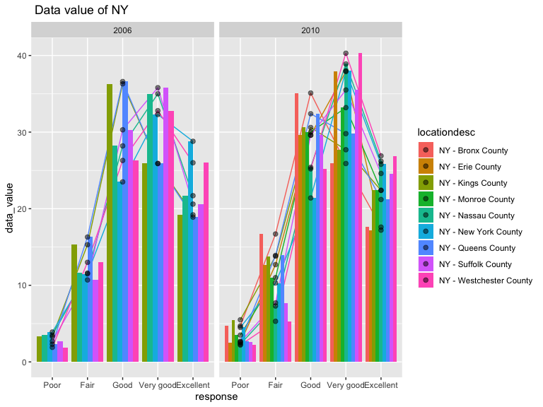

p8105\_hw3\_ys3298
================
Yimeng SHANG
10/3/2019

``` r
library(p8105.datasets)
library(tidyverse)
```

    ## ── Attaching packages ──────────────────────────────────────────────────────────────────────────────────────────────────── tidyverse 1.2.1 ──

    ## ✔ ggplot2 3.2.1     ✔ purrr   0.3.2
    ## ✔ tibble  2.1.3     ✔ dplyr   0.8.3
    ## ✔ tidyr   1.0.0     ✔ stringr 1.4.0
    ## ✔ readr   1.3.1     ✔ forcats 0.4.0

    ## ── Conflicts ─────────────────────────────────────────────────────────────────────────────────────────────────────── tidyverse_conflicts() ──
    ## ✖ dplyr::filter() masks stats::filter()
    ## ✖ dplyr::lag()    masks stats::lag()

``` r
library(patchwork)
data("instacart")
data("brfss_smart2010")
accel = read_csv("./accel_data.csv") 
```

    ## Parsed with column specification:
    ## cols(
    ##   .default = col_double(),
    ##   day = col_character()
    ## )

    ## See spec(...) for full column specifications.

# Problem1

## Short description

**The size and structure of the data:** There are 1384617 observations
and 15 variables in the data. It’s a (1384617, 15) dataframe. Most of
the variable types are integers and some are characters.

**Some key variables:** Product name; aisle; department; order number
and so on.

**illstrative examples of observations:** For the 1st order, there’re 8
different kind of products. Eval set is train. In details, the first
product is Bulgarian Yogurt, aisle id is 120, department id is 16, aisle
is yogurt, department is dairy eggs. For the second observations, aisle
id is 108, department id is 16, aisle is other creams cheeses,
department is dairy eggs .

**How many aisles are there, and which aisles are the most items ordered
from?** There are 134 aisles. The most items ordered from fresh
vegetables.

## Make a plot


From the plot, we can clearly see the rank of number of items ordered in
each aisle. The orders from fresh vegetables are the most and butter is
the
least.

## Table1: most populat items in each aisles

| group                      | product\_name                                 | order\_times |
| :------------------------- | :-------------------------------------------- | -----------: |
| baking ingredients         | Cane Sugar                                    |          336 |
| baking ingredients         | Light Brown Sugar                             |          499 |
| baking ingredients         | Pure Baking Soda                              |          387 |
| dog food care              | Organix Chicken & Brown Rice Recipe           |           28 |
| dog food care              | Small Dog Biscuits                            |           26 |
| dog food care              | Snack Sticks Chicken & Rice Recipe Dog Treats |           30 |
| packaged vegetables fruits | Organic Baby Spinach                          |         9784 |
| packaged vegetables fruits | Organic Blueberries                           |         4966 |
| packaged vegetables fruits | Organic Raspberries                           |         5546 |

From the table, the most popular items from baking ingredients are cane
sugar, light brown sugar and pure baking soda. In the group of dog food
care, organix chicken\&brown rice recipe, small dog biscuits, snack
sticks chicken & rice recipe dog treats are the top3 popular items. And
in the group of packaged vegetables fruits, organic baby spinach,
organic blueberries, organic raspverries sells best.

## Table2: mean hour of a day ordered on each day

| product\_name    | Sun | Mon | Tue | Wed | Thur | Fri | Sat |
| :--------------- | --: | --: | --: | --: | ---: | --: | --: |
| Coffee Ice Cream |  13 |  14 |  15 |  15 |   15 |  12 |  13 |
| Pink Lady Apples |  13 |  11 |  11 |  14 |   11 |  12 |  11 |

From this table, we can clearly see the mean hour of the day at which
pink lady apples and coffee ice cream are ordered on each day of the
week. In order to see clearly, I round the value to integer.

# Problem2

In 2002, CT, FL, NC, MA, NJ, PA were observed at 7 or more locations.

In 2010, CO, PA, SC, OH, MA, NY, NE, WA, CA, MD, NC, TX, NJ, FL were
observed at 7 or more
locations.


This figure has so many states information, so it’s not so clearly to
see. We notice that most of the states fluctuate from 2002 to
2010.


From the Plot, we can see the distribution of data value for reponses
among locations. “Poor” was the lowest and “Very good” and “Excellent”
and relatively high. There is difference in different locations. Form
2006 to 2010, the distribution changed a little bit.

or In this
way:



# Problem3

For this resulting dataset, there are 35 observations and 1444
variables. It also includes the week, day ID, weekend or weekday
information.

| week | day\_id | day       | weekday\_end |    sum |
| ---: | ------: | :-------- | :----------- | -----: |
|    1 |       1 | Friday    | weekday      | 480276 |
|    1 |       2 | Monday    | weekday      |  78525 |
|    1 |       3 | Saturday  | weekend      | 376017 |
|    1 |       4 | Sunday    | weekend      | 629710 |
|    1 |       5 | Thursday  | weekday      | 354987 |
|    1 |       6 | Tuesday   | weekday      | 306136 |
|    1 |       7 | Wednesday | weekday      | 339209 |
|    2 |       8 | Friday    | weekday      | 568835 |
|    2 |       9 | Monday    | weekday      | 295427 |
|    2 |      10 | Saturday  | weekend      | 607024 |
|    2 |      11 | Sunday    | weekend      | 421781 |
|    2 |      12 | Thursday  | weekday      | 472059 |
|    2 |      13 | Tuesday   | weekday      | 423231 |
|    2 |      14 | Wednesday | weekday      | 440948 |
|    3 |      15 | Friday    | weekday      | 467416 |
|    3 |      16 | Monday    | weekday      | 685906 |
|    3 |      17 | Saturday  | weekend      | 382914 |
|    3 |      18 | Sunday    | weekend      | 467027 |
|    3 |      19 | Thursday  | weekday      | 371226 |
|    3 |      20 | Tuesday   | weekday      | 381503 |
|    3 |      21 | Wednesday | weekday      | 468772 |
|    4 |      22 | Friday    | weekday      | 154045 |
|    4 |      23 | Monday    | weekday      | 408898 |
|    4 |      24 | Saturday  | weekend      |   1436 |
|    4 |      25 | Sunday    | weekend      | 260613 |
|    4 |      26 | Thursday  | weekday      | 340287 |
|    4 |      27 | Tuesday   | weekday      | 319075 |
|    4 |      28 | Wednesday | weekday      | 432626 |
|    5 |      29 | Friday    | weekday      | 620856 |
|    5 |      30 | Monday    | weekday      | 388950 |
|    5 |      31 | Saturday  | weekend      |   1436 |
|    5 |      32 | Sunday    | weekend      | 138417 |
|    5 |      33 | Thursday  | weekday      | 549654 |
|    5 |      34 | Tuesday   | weekday      | 367757 |
|    5 |      35 | Wednesday | weekday      | 445257 |

This table in not clear to see the trend. However, there are a few
number greater than 10000 and most of them come from Thursday. It’s
relatively low at the first few weeks and than increase and finally go
down.


Based on this graph, we can see the total number in Thursday is
relatively high and fluctuate dramaticly. For Saturday, the value first
wen up and than went down. Most of them declined comparing with the 1st
week.
